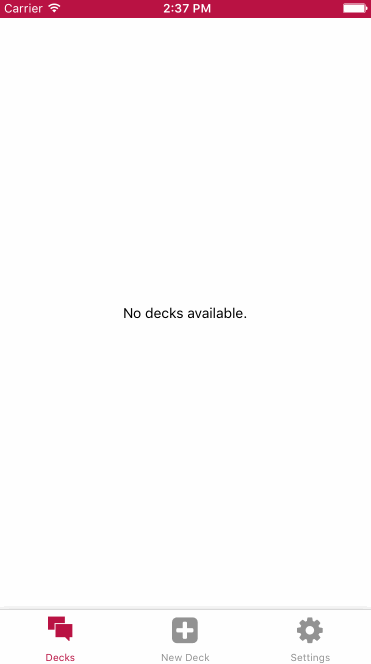

# Mobile FlashCards

IPhone-App that let you learn with flash-cards.

This app allows you to study collections of flashcards. The app will allow you
to create different categories of flashcards called "decks", add flashcards
to those decks, then take quizzes on those decks.



<!-- MarkdownTOC levels="1" autolink=true autoanchor=false bracket="round" -->

- [Installation](#installation)
- [Compatibilty](#compatibilty)
- [Available Scripts](#available-scripts)
  - [`npm start`](#npm-start)
- [Create React Native App](#create-react-native-app)

<!-- /MarkdownTOC -->

## Installation

```sh
git clone git@github.com:elioschmutz/mobile-flashcards.git
cd mobile-flashcards
npm install
npm run ios
```

## Compatibilty

Tested on:

- [x] IOS
- [ ] Android

Runs on:

- [x] IOS
- [x] Android

## Available Scripts

If Yarn was installed when the project was initialized, then dependencies will have been installed via Yarn, and you should probably use it to run these commands as well. Unlike dependency installation, command running syntax is identical for Yarn and NPM at the time of this writing.

### `npm start`

Runs your app in development mode.

Open it in the [Expo app](https://expo.io) on your phone to view it. It will reload if you save edits to your files, and you will see build errors and logs in the terminal.

Sometimes you may need to reset or clear the React Native packager's cache. To do so, you can pass the `--reset-cache` flag to the start script:

```
npm start --reset-cache
# or
yarn start --reset-cache
```

#### `npm run ios`

Like `npm start`, but also attempts to open your app in the iOS Simulator if you're on a Mac and have it installed.

#### `npm run android`

Like `npm start`, but also attempts to open your app on a connected Android device or emulator. Requires an installation of Android build tools (see [React Native docs](https://facebook.github.io/react-native/docs/getting-started.html) for detailed setup). We also recommend installing Genymotion as your Android emulator. Once you've finished setting up the native build environment, there are two options for making the right copy of `adb` available to Create React Native App:

## Create React Native App

This project was bootstrapped with [Create React Native App](https://github.com/react-community/create-react-native-app).

Below you'll find information about performing common tasks. The most recent version of this guide is available [here](https://github.com/react-community/create-react-native-app/blob/master/react-native-scripts/template/README.md).
